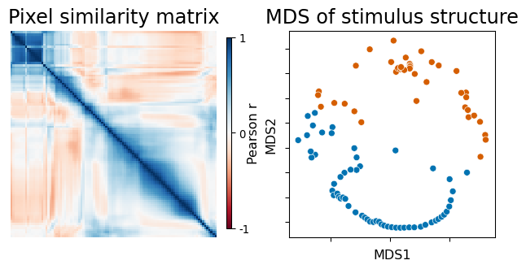
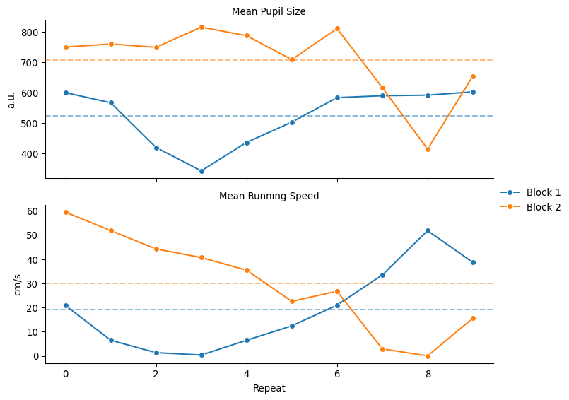
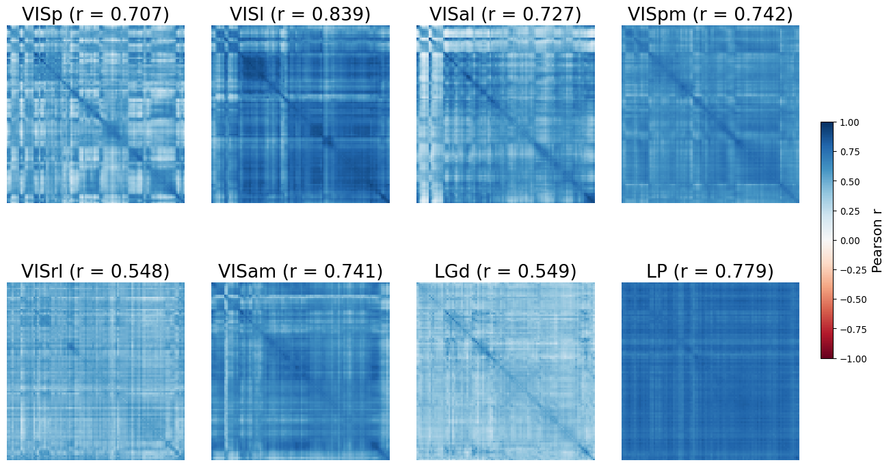

# undecided
Dr. Akash Mer
2026-06-08

## Stimulus Description

### Experimental Setup

The raw data came from the Allen Brain Observatory “Visual Coding”
project. Mice were head-fixed in front of a monitor and shown various
visual stimuli: drifting gratings, natural images and natural movies.
During this time, neural activity was recorded using two-photon calcium
imaging and Neuropixels probes in two different cohorts of mice. The
following analysis is limited to sessions when the stimulus was Natural
Movie 1. The stimulus is presented repeatedly. The Neuropixels recording
sessions include two movie types: - Natural Movie 1 - Natural Movie 1
shuffled

**Ethological significance of Natural Movie 1**: Natural movie 1 is a
~30 second black-and-white movie clip from the film *Touch of Evil*.
Thus the movie is more ethologically significant than gratings or
images. The scene contains a perspective from a human filming which
might limit its ideal ethological definition from a mouse’s perspective.

**Brain areas**: The brain areas recorded were:

- *Primary Visual Cortex*: VISp
- *Higher Visual Areas*:
  - *Lateral Visual Area*: VISl
  - *Anterolateral Visual Area*: VISal
  - *Posteromedial Visual Area*: VISpm
  - *Rostrolateral Visual Area*: VISrl
  - *Anteromedial Visual Area*: VISam
- *Thalamic areas*:
  - *Dorsal part of the Lateral Geniculate complex*: LGd
  - *Lateral Posterior nucleus*: LP

These areas match the visual perception circuitry in mice.

**Context of the recorded activity**: All sessions were recorded under
similar conditions of passive viewing and the same recording paradigm
which reduces the effect of global brain states. Both datasets also
include behavioral state measures: pupil metrics (movement, position,
size, and width) and running speed. <!--
I plan to compare the pupil size and movement and running speed to mean cross-trial reliability of the population response to gauge how reliably each block/session represents the stimulus. 
The mean cross-trial reliability will be computed from cross-trial correlations instead of averaging across trials. Session weights for the final representational map will be informed by both the number of neurons recorded in each area and each session's cross-trial reliability(if confirmed by behavioral co-variance).
-->

<details class="code-fold">
<summary>Imports</summary>

``` python
import warnings
warnings.filterwarnings('ignore', message='pkg_resources is deprecated')
warnings.filterwarnings('ignore', category=UserWarning, module='allensdk')
warnings.filterwarnings('ignore', category=RuntimeWarning, module='threadpoolctl')
warnings.filterwarnings('ignore', category=UserWarning, module='sklearn')
import os
from pathlib import Path
import numpy as np
import pandas as pd
from pymatreader import read_mat
from allensdk.brain_observatory.ecephys.ecephys_project_cache import EcephysProjectCache
from allensdk.core.brain_observatory_cache import BrainObservatoryCache
import matplotlib.pyplot as plt
import seaborn as sns
from scipy.spatial.distance import cdist
import itertools
from sklearn.manifold import MDS
from sklearn.cluster import KMeans
```

</details>

<details class="code-fold">
<summary>Code</summary>

``` python
# Download Natural Movie 1
manifest_path = os.path.join(os.path.expanduser('~'), 'allen_cache_ecephys', 'manifest.json')
cache = EcephysProjectCache.from_warehouse(manifest=manifest_path)
movie = cache.get_natural_movie_template(1)

# Bin movie frames into 30 one-second bins
movie_binned = movie.reshape(30, 30, 304, 608).mean(axis=1)  # (30, 304, 608)
movie_flat = movie_binned.reshape(30, -1).astype(float)       # (30, 184832)

# Create a Pixel Similarity Matrix (30 x 30)
pixel_similarity = 1 - cdist(movie_flat, movie_flat, metric='correlation')

# MDS on the pixel dissimilarity matrix to visualize
mds_random_state = 45
mds = MDS(n_components=2, dissimilarity='precomputed', random_state=mds_random_state, n_init = 1)
stimulus_mds = mds.fit_transform(1 - pixel_similarity)

# Check how the movie gets separated for 2 clusters
stimulus_clusters = KMeans(n_clusters=2, random_state=32).fit_predict(stimulus_mds)
# Define color for 2 clusters
cluster_palette = sns.color_palette('Dark2', n_colors=2)

# Shared Styling
title_fontsize = 18
label_fontsize = 12
frame_aspect = movie_binned.shape[1] / movie_binned.shape[2]

# Plot with matrix and mds scatter in 1st column and binned movie frames in 2nd
fig = plt.figure(figsize=(16, 9))
subfigs = fig.subfigures(1, 2, width_ratios=[0.3, 1], wspace=0.02)
left_axes = subfigs[0].subplots(2, 1)
ax_heatmap, ax_scatter = left_axes

# Pixel similarity matrix
sns.heatmap(pixel_similarity, cmap='RdBu', square=True, xticklabels=False, yticklabels=False,
            cbar=False, vmin=-1, vmax=1, ax=ax_heatmap)
ax_heatmap.set_title('Pixel similarity matrix', fontsize=title_fontsize, pad=8)

# Stimulus structure
sns.scatterplot(x=stimulus_mds[:, 0], y=stimulus_mds[:, 1],
                hue=stimulus_clusters, palette=cluster_palette, legend=False, ax=ax_scatter)
ax_scatter.set_box_aspect(1)
ax_scatter.set_xlabel('MDS1', fontsize=label_fontsize)
ax_scatter.set_ylabel('MDS2', fontsize=label_fontsize)
ax_scatter.set_xticklabels([])
ax_scatter.set_yticklabels([])
ax_scatter.set_title('MDS of stimulus structure', fontsize=title_fontsize, pad=8)

# What is the pixel similarity capturing?
axes_frames = subfigs[1].subplots(5, 6, gridspec_kw={'left': 0.05, 'right': 0.98,
                                                     'wspace': 0.05, 'hspace': 0.02})
for i, ax in enumerate(axes_frames.flat):
    ax.imshow(movie_binned[i], cmap='gray')
    ax.set_box_aspect(frame_aspect)
    ax.set_xticks([])
    ax.set_yticks([])
    for spine in ax.spines.values():
        spine.set_edgecolor(cluster_palette[stimulus_clusters[i]])
        spine.set_linewidth(2)
subfigs[1].suptitle('Binned movie frames by cluster', fontsize=title_fontsize, y=0.90);

# Add the color legend in the space between 2 columns
cbar_ax = fig.add_axes([0.22, 0.56, 0.008, 0.28])
cbar = fig.colorbar(ax_heatmap.collections[0], cax=cbar_ax, ticks=[-1, 0, 1])
cbar.ax.set_yticklabels(['-1', '0', '1'])
cbar.set_label('Pearson r', labelpad=-2, fontsize=12)
```

</details>

<div id="fig-stimulus-structure">



Figure 1: Stimulus Structure

</div>

Natural Movie 1 was played at 30 fps thus the movie frames were binned
to one-second bins with 30 frames per bin. Binwise pixel correlation was
computed and showed 2 distinct regions around bins 9-12. This prompted
me to apply KMeans clustering(k=2) to the MDS of the correlation matrix
to visualize the structure. I guessed two clusters before seeing the
movie clip based on binwise pixel correlation heatmap. The movie
clustered into two structurally distinct halves which can be used for
validation of the neural representational map. The frame-by-frame check
of the bins gave the context for the 2 clusters. A car becomes clearly
visible around bins 9-12 preceded by a motion blur implying a clear
scene change.

## Data Structure

### Preprocessed Data Structure

| **Modality** | **Variable Name** | **Structure** |
|----|----|----|
| *Calcium (Excitatory)* | `raw_pop_vector_info_trials` | `n` neurons $\times$ `30` bins $\times$ `30` trials |
| *Calcium (Inhibitory)* | `united_traces_days_events` | `n` neurons $\times$ `n` frames $\times$ `3` days |
| *Neuropixels* | `informative_rater_mat` | `n` neurons $\times$ `n` frames $\times$ `2` blocks |

Calcium (Inhibitory) data is excluded since it is stored as unbinned raw
traces. I am unaware of how to use the interneuron data as an input to
the representational map. Neuropixels data is also unbinned and will be
binned during preprocessing.

### Cohort Size

<details class="code-fold">
<summary>Code</summary>

``` python
# Get the current data-slug for the current folder and the data directory
current_dir = Path.cwd()
data_slug = current_dir.name
data_path = current_dir.parents[1] / "data" / data_slug

# Compute the cohort size of neuropixels modality
manifest_path = os.path.join(os.path.expanduser('~'), 'allen_cache_ecephys', 'manifest.json')
cache = EcephysProjectCache.from_warehouse(manifest=manifest_path)
# Get the number of unique mice in the Neuropixels data
neuropixels_session_table = cache.get_session_table()
# The session_id is in the index id
neuropixels_session_table = neuropixels_session_table.reset_index()
# Each session is equivalent to each mouse. 58 total

# Compute the cohort size of calcium_excitatory modality
manifest_path_cal = os.path.join(os.path.expanduser('~'), 'allen_cache_ophys', 'manifest.json')
cache_cal = BrainObservatoryCache(manifest_file=manifest_path_cal)
calcium_session_info = cache_cal.get_experiment_containers()
calcium_session_table = pd.DataFrame(columns=["id", 'donor_name'], index=range(len(calcium_session_info)))
for i in range(len(calcium_session_info)):
    calcium_session_table.loc[i, 'id'] = calcium_session_info[i]['id']
    calcium_session_table.loc[i, 'donor_name'] = calcium_session_info[i]['donor_name']
# Get the id of the processed data
processed_data_id = [int(f.stem) for f in data_path.glob('calcium_excitatory/*/*.mat')] # 336
# Filter the session table
filtered_calcium_session_table = calcium_session_table[calcium_session_table['id'].isin(processed_data_id)]
# 193 mice, with multuple sessions
```

</details>

| **Modality**                   | **Unique Mice** |
|--------------------------------|-----------------|
| *Calcium Imaging (Excitatory)* | 193             |
| *Neuropixels*                  | 58              |

Calcium (Excitatory) processed files number 336 but they are from 193
unique mice. Neuropixels processed files number 58, implying 1 session
per mouse.

### Per-Mouse Neuron Coverage

#### Calcium Imaging (Excitatory)

<details class="code-fold">
<summary>Code</summary>

``` python
# Define the area names as per visual_drift analysis
brain_areas = ['VISp','VISl','VISal','VISpm','VISrl','VISam','LGd','LP']

# How many neurons recorded per mice per session?
calcium_area_wise = pd.DataFrame(columns=['session_id', 'area', 'n_neurons'], index = range(336))
idx = 0
for f in data_path.glob('calcium_excitatory/**/*.mat'):
    calcium_area_wise.loc[idx, 'session_id'] = int(f.stem)
    calcium_area_wise.loc[idx, 'area'] = f.parent.name
    load_file = read_mat(f)
    calcium_area_wise.loc[idx, 'n_neurons'] = load_file['raw_pop_vector_info_trials'].shape[0]
    idx+=1
# Pivot to wide format and add mouse id info
calcium_area_wise = (
    calcium_area_wise
    .merge(filtered_calcium_session_table, how = 'left',
            left_on = 'session_id', right_on = 'id')
    .drop(columns = 'id')
    # Get the minimum number of neurons per area per mice
    .pivot_table(index = 'donor_name', columns = 'area', values = 'n_neurons', aggfunc='min')
    .fillna(0)
    .merge(filtered_calcium_session_table.groupby('donor_name')['id']
                                            .apply(list).reset_index(),
            how = 'left', on = 'donor_name')
)
# Convert number of neurons to int type
calcium_area_wise[brain_areas[:6]] = calcium_area_wise[brain_areas[:6]].astype(int)
# Order by maximum number of areas covered per mice
calcium_area_wise = (
    calcium_area_wise.assign(n_areas=lambda x: (x[brain_areas[:6]] > 0).sum(axis=1))
    .sort_values('n_areas', ascending=False)
    .drop(columns='n_areas')
    .assign(total=lambda x: x[brain_areas[:6]].sum(axis = 1).astype(int))
    .set_index('donor_name')
    .rename_axis('Donor ID')
    .rename(columns = {'total':'Total'})
)
# Display the the best 2 and worst 2
pd.concat([calcium_area_wise[brain_areas[:6] + ['Total']].head(2),
            calcium_area_wise[brain_areas[:6] + ['Total']].tail(2)])
```

</details>

<div>
<style scoped>
    .dataframe tbody tr th:only-of-type {
        vertical-align: middle;
    }
&#10;    .dataframe tbody tr th {
        vertical-align: top;
    }
&#10;    .dataframe thead th {
        text-align: right;
    }
</style>

|          | VISp | VISl | VISal | VISpm | VISrl | VISam | Total |
|----------|------|------|-------|-------|-------|-------|-------|
| Donor ID |      |      |       |       |       |       |       |
| 323982   | 163  | 90   | 0     | 143   | 0     | 0     | 396   |
| 309689   | 21   | 11   | 30    | 0     | 0     | 0     | 62    |
| 315297   | 41   | 0    | 0     | 0     | 0     | 0     | 41    |
| 221470   | 237  | 0    | 0     | 0     | 0     | 0     | 237   |

</div>

None of the subjects under this modality had all the areas covered.
\[@Noda_2024-03-22\] advises ideal cohort size for a representational
map estimation to be 1 if sufficient number of neurons are recorded. One
of the goals of this analysis is to portray various properties of a
representational map defined in \[@Noda_2024-03-22\]. The hierarchical
nature of representational maps cannot be shown in the case of the above
calcium imaging data due to lack of coverage of all areas in a single
subject. Thus, it was excluded from the analysis.

#### Neuropixels

<details class="code-fold">
<summary>Code</summary>

``` python
# How many neurons recorded per mice per session?
neuropixels_area_wise = pd.DataFrame(columns=['session_id'] + brain_areas, index = range(58))
idx = 0
for f in data_path.glob('neuropixels/*.mat'):
    load_file = read_mat(f)
    neuropixels_area_wise.loc[idx, 'session_id'] = int(f.stem.replace('session_', ''))
    for num, area in enumerate(brain_areas):
        if load_file['informative_rater_mat'][0][num].size > 0:
            neuropixels_area_wise.loc[idx, area] = load_file['informative_rater_mat'][0][num].shape[0]
        else:
            neuropixels_area_wise.loc[idx, area] = 0
    idx +=1
# Combine both mouse id info and this area wise neurons into one table
neuropixels_area_wise = (
    neuropixels_area_wise.merge(neuropixels_session_table[['id', 'specimen_id']], how='left', left_on='session_id', right_on='id')
    .drop(columns='id')
    .set_index('session_id')
    .pipe(lambda df: df.assign(**{a: pd.to_numeric(df[a]) for a in brain_areas}))
    .query(' and '.join([f'{a} > 0' for a in brain_areas]))
    # Sort by minimum neuron count across cortical areas only (thalamic areas excluded)
    .assign(min=lambda x: x[brain_areas[:6]].min(axis = 1))
    .sort_values('min', ascending=False)
    .drop(columns = 'min')
    .assign(total=lambda x: x[brain_areas].sum(axis = 1).astype(int))
    .rename_axis('Session ID')
    .rename(columns = {'specimen_id':'Specimen ID', 'total':'Total'})
)
# Order the columns and display the best 2 and worst 2
pd.concat([neuropixels_area_wise[['Specimen ID'] + brain_areas + ['Total']].head(2),
            neuropixels_area_wise[['Specimen ID'] + brain_areas + ['Total']].tail(2)])
```

</details>

<div>
<style scoped>
    .dataframe tbody tr th:only-of-type {
        vertical-align: middle;
    }
&#10;    .dataframe tbody tr th {
        vertical-align: top;
    }
&#10;    .dataframe thead th {
        text-align: right;
    }
</style>

|            | Specimen ID | VISp | VISl | VISal | VISpm | VISrl | VISam | LGd | LP  | Total |
|------------|-------------|------|------|-------|-------|-------|-------|-----|-----|-------|
| Session ID |             |      |      |       |       |       |       |     |     |       |
| 755434585  | 730760270   | 75   | 39   | 42    | 62    | 49    | 94    | 44  | 27  | 432   |
| 756029989  | 734865738   | 51   | 30   | 51    | 90    | 24    | 72    | 60  | 27  | 405   |
| 778240327  | 760938797   | 85   | 62   | 82    | 68    | 13    | 77    | 2   | 51  | 440   |
| 719161530  | 703279284   | 52   | 40   | 9     | 18    | 10    | 37    | 71  | 28  | 265   |

</div>

Several mice had complete coverage of all 8 areas. The above table shows
the 2 best and worst candidates sorted by the minimum cortical neuron
count, excluding thalamic areas (LGd, LP) which are harder to record.
Session `755434585` / Mouse `730760270` and Session `756029989` / Mouse
`734865738` were picked for applying the estimation pipeline since both
had sufficient number of neurons in all areas with total number of
neurons sitting within the range of 100s to tens of
thousands\[@Noda_2024-03-22\].

## Behavioral State

Global brain states affect representational map estimates by suppressing
elements or shifting their positions. Standardizing experimental
conditions or measuring brain state explicitly is
advised\[@Noda_2024-03-22\]. The passive viewing design already
standardizes the experimental context. Several behavioral metrics such
as pupil size, position, width, movement and running speed are measured
and reported in the dataset.

On inspection of block-wise behavioral patterns and RSM structure of the
two top candidate sessions (`755434585` and `756029989`), the key
observations were:

- **Session `755434585` Block 1**: Resting with constricted pupils
  majority of the time. The RSM showed minimal structure likely implying
  a drowsy state.
- **Session `755434585` Block 2**: The mouse was actively running and
  RSM showed a richer structure.
- **Session `755434585` combined blocks**: Combining both blocks (20
  trials) reduced reliability measure produced from cross-trial
  correlation approach. This confirms that two blocks represent distinct
  brain states.
- **Session `756029989` Block 1 and Block 2**: The RSM structure was
  rich and consistent across both blocks. The behavioral metrics were
  not so polar in this case.

Session `756029989` / Mouse `734865738` was selected since it satisfied
the following criteria:

- complete area coverage
- non-drowsy behavioral state

Thus, making it a suitable substrate for demonstrating the full
estimation pipeline. Block 1 was used as the analysis block due to lower
mean running speed.

<details class="code-fold">
<summary>Code</summary>

``` python
# Define the data file chosen for analysis
data_file = 'session_756029989.mat'
# Load the processed data
data = read_mat(data_path / "neuropixels" / data_file)

# Extract the mean_pupil_size for Natural Movie 1
mean_pupil_size = data['mean_pupil_size_repeats'][0]
# Extract the mean running speed for Natural Movie 1
mean_running_speed = data['mean_running_speed_repeats'][0]

# Define a df to hold the behavioral data for plotting
behavioral_metrics = (pd.concat([
        pd.DataFrame(mean_pupil_size, columns=['Block 1', 'Block 2']).assign(metric='Mean Pupil Size'),
        pd.DataFrame(mean_running_speed,  columns=['Block 1', 'Block 2']).assign(metric='Mean Running Speed')
    ])
    .reset_index(names='repeat')
    .melt(id_vars = ['repeat', 'metric'], value_vars = ['Block 1', 'Block 2'],
            var_name = 'block', value_name = 'value')
)

# Plot in a Seaborn grid
g = sns.FacetGrid(behavioral_metrics, row = 'metric', sharey = False, height = 3, aspect = 2.5)
g.map_dataframe(sns.lineplot, x='repeat', y='value', hue='block', marker='o')
g.add_legend()
g.set_axis_labels(x_var='Repeat', y_var='')
g.set_titles(row_template='{row_name}')
# Define the y-axis unit labels
y_labels = {'Mean Pupil Size': 'a.u.', 'Mean Running Speed': 'cm/s'}
for ax, metric in zip(g.axes.flat, y_labels):
    ax.set_ylabel(y_labels[metric])
```

</details>

<div id="fig-behavioral_state">



Figure 2: Behavioral State Comparison of 2 Blocks in Session 756029989
(Mouse ID - 734865738)

</div>

The full block-by-block RSM comparison of the two candidate sessions is
shown in [Appendix A](#appendix-a).

## High-Dimensional Population Response Space

The high-dimensional population response space can be interpretated by
computing Representational Similarity Matrix(RSM) for each area. The
neuron spike counts were averaged across frames in a bin since the movie
was played at 30 fps. Pearson correlation was chosen since it is the
standard metric for RSA. A crosswise single-trial correlation approach
was implemented instead of averaging across trials. This allowed the
diagonal of the matrix to serve as a trial-to-trial reliability measure,
thus informing interpretation of representational map structure from the
heatmap.

<details class="code-fold">
<summary>Code</summary>

``` python
# Define a function to compute rsm preserving the trial to trial reliability
def compute_rsm(area_data, bins, trials):
    # Get the number of neurons
    n_neurons = area_data.shape[0]
    # Reshape into 10 repeats x 30 bins x 30 frames
    reshaped_data = np.reshape(area_data, (n_neurons, trials, bins, bins))
    # Average out the frame
    binned_data = np.mean(reshaped_data, axis = 3)
    # Transpose to change the structure to bins x repeats x neurons
    binned_data = np.transpose(binned_data, (2, 1, 0))
    # Flatten bins and repeats for cdist function
    binned_data = np.reshape(binned_data, (bins * trials, n_neurons))

    # Compute the disimilarity matrix using pearson correlation
    dist_matrix = cdist(binned_data, binned_data, metric='correlation')

    # Convert to a similarity matrix
    similarity_matrix = 1 - dist_matrix

    # Block the diagonal to preserve trial-to-trial reliability measure
    for i in range(bins):
        block = similarity_matrix[i*trials:(i+1)*trials, i*trials:(i+1)*trials]
        np.fill_diagonal(block, np.nan)

    # Fisher Z transforamtion to average correlation within bins
    z_matrix = np.arctanh(similarity_matrix)

    # Averge within bins
    res = np.zeros((bins, bins))
    for j, k in itertools.product(range(bins), range(bins)):
        block = z_matrix[j*trials:(j+1)*trials, k*trials:(k+1)*trials]
        if j == k:
            res[j, k] = np.nanmean(block)
        else:
            res[j, k] = np.mean(block)

    # Transform back to correlations and return
    return np.tanh(res)

# Get the neural activity data for block 1
neuropixels_data = [area[:, :, 0] for area in data['informative_rater_mat'][0][:8]]
# Define the number of bins
n_bins = 30
# Define the number of trials
n_trials = 10
# Initialize a population reponse space variable
rsms = {}
# Compute RSMs for each area
for idx, area in enumerate(brain_areas):
    rsms[area] = pd.DataFrame(compute_rsm(neuropixels_data[idx], n_bins, n_trials), index=range(n_bins), columns=range(n_bins))

# Plot the RSMs per area
fig, axes = plt.subplots(2, 4, figsize=(16, 9))
fig.subplots_adjust(right=0.88)
axes = axes.flatten()
for plot_idx, item in enumerate(rsms):
    sns.heatmap(rsms[item], ax=axes[plot_idx], cmap='RdBu', cbar=False,
                square=True, center=0)
    axes[plot_idx].set_title(item, fontsize=20)
    axes[plot_idx].set_xticks([])
    axes[plot_idx].set_yticks([])
# Add the colorbar
cbar_ax = fig.add_axes([0.90, 0.30, 0.012, 0.40])
sm = plt.cm.ScalarMappable(cmap='RdBu')
cbar = fig.colorbar(sm, cax=cbar_ax)
cbar.set_label('Pearson r', labelpad=5, fontsize=15)
```

</details>

<div id="fig-population-reponse-space">



Figure 3: RSMs for Block 1 of Session 756029989 (Mouse ID - 734865738)

</div>

### Interpretation

- *VISp*: Diagonal is dark for almost all bins, implying high
  trial-to-trial reliability.
  - Similarity between off-diagonal bins is not grouped into 2 distinct
    structures but shows small blocks containing adjacent bins. This
    suggests the area is capturing adjacent bin similarities which
    usually have similar visual cue features.
- *VISl and VISal*: Shows similar reliability as VISp. VISal
  trial-to-trial reliability reduces in the central bins.
  - Structure is grouped into 2 distinct areas almost coinciding with
    the stimulus clusters
  - The striped pattern within the group in certain bins suggests
    selectivity for visual features that recur across the movie.
- *VISpm*: The reliability measure is lower at the beginning and at the
  end.
  - Structure is grouped along the diagonal in blocks sizes of ~4 bins,
    ~7 bins, and ~10 bins.
- *VISam*: The reliability measure is low in the central bins.
  - Structure is grouped into 3 distinct areas with boundaries at 5th
    and 10th bins. This matches the bin when the motion blur appears and
    disappears in the movie.
  - The striped pattern within the groups is present but does not extend
    outside the group unlike VISl and VISal.
- *VISrl and LGd*: Reliability measure is the lowest in both.
  - The off-diagonal structure is present but no strong grouping is
    visible.
- *LP*: Absence of diagonal contrast makes commenting on reliability
  difficult.
  - Off-diagonal similarity bins are equally similar throughout.

The findings above suggest the presence of hierarchical representational
maps which evolve along the neuronal circuit.
